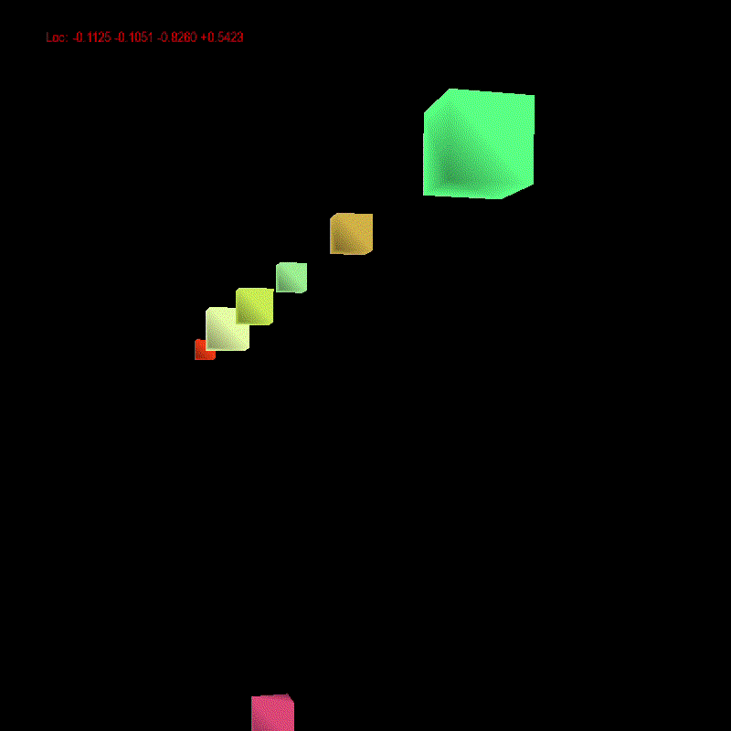

### 四维球空间模拟

#### 概述
三维空间的观察者被封闭在x^2+y^2+z^2+w^2=r^2的四维球面上, 初始时位置(0,0,0,r), 视线方向(0,0,1,0)

类比二维蚂蚁在三维球面上的情况, 根据几何规律实现. 通过PyOpenGL绘制观察到的三维画面. 
空间中随机放置70个立方体和均匀放置31个立方体.

#### 使用方法
pip install pygame PyOpenGL PyOpenGL-accelerate  
python3 demo.py

键盘的AD键调整左右视角, WS键调整仰俯视角, 上下方向键前进和后退. 窗口上方显示四维空间坐标.

#### 效果
* 当球半径相对很大时, 观察情况与一般三维空间类似.  
* 朝任意一个方向不断笔直前进, 最终将会回到出发点.  

